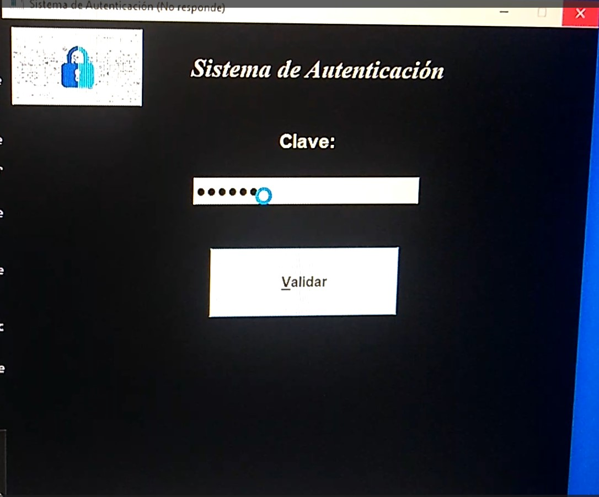

# 🔐 Cerradura Inteligente con Reconocimiento Facial  

Este proyecto implementa un sistema de **reconocimiento facial** utilizando **OpenCV** (EigenFaceRecognizer) y una interfaz gráfica en **PyQt5**.  
Cuando un rostro es **reconocido positivamente**, el sistema se comunica con un **Arduino** a través del puerto serial y activa un **servomotor**, simulando una cerradura inteligente.  

---
✅ Interfaz gráfica hecha en PyQt5.

✅ Entrenamiento de modelos de reconocimiento facial con EigenFaceRecognizer de OpenCV.

✅ Detección en tiempo real con la cámara web.

✅ Comunicación con Arduino vía puerto Serial (pyserial).

✅ Activación de un servomotor que simula una cerradura.

